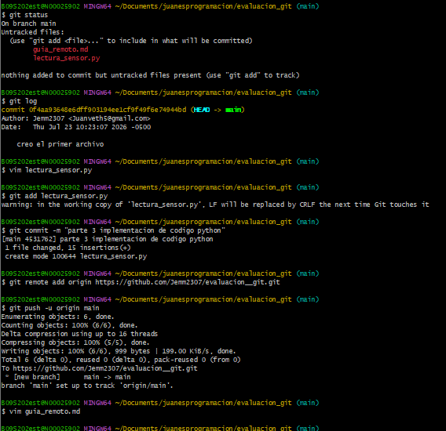

#  **SEGUNDA GUIA EN TECNICA MARKDOWN"  

## *PROCESO PARA CREAR UN REPOSITORIO REMOTO EN GIT HUB*  
1. Despues de crear una cuenta en git hub le damos a nuevo repositorio
2. ponemos nombre descripcion y copiamos el link
3. despues de crear el link mediante **git remote add origin** copiamos el link
y lo pegamos
4. git push para terminarlo subiendo al git hub  

## *COMANDOS PUSH Y PULL*
el comando push funciona para enlazar lo que ya tenemos en el local con la cuenta en git hub esto mediante el link y el pull funciona para lo contrario enlazar
lo que tenemos en la nube al computador esto mediante el link que da la nube 

